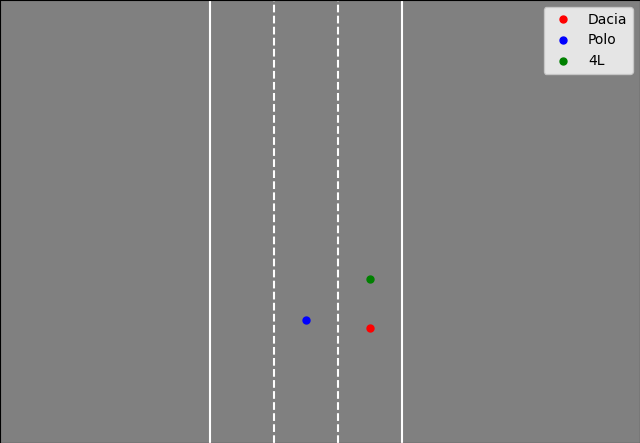

# Microtrafic

Essai de simulation de trafic à l'échelle macro

**Note du 04/09/2023:**

S'assurer que toutes les distances de sécurité sont respéctées avant de créer une voiture (x, y, v). Fait [x]. Mais les voitures s'arrêtent toujours à un certain moment, certainement à cause de la voiture qui les précèdent.
Créer des paramètres de flux pour s'assurer également qu'il y a assez de route pour contenir le nombre de voiture désiré.

**Note du 11/09/2023:**
Essayer de prioritiser les voitures de la lignes de droite. Donc implémenter dans voiture une méthode spéciale pour comparer voit1 < voit2 selon d'abord x puis y.

Essai i infructueux pour voit1 < voit2 selon d'abord x puis y, mais efficace pour comparaison selon y uniquement. Néanmoins les voitures semblent faire des sauts. Voir si uniquement à cause de matplotlib qui distribueles couleurs différement.
